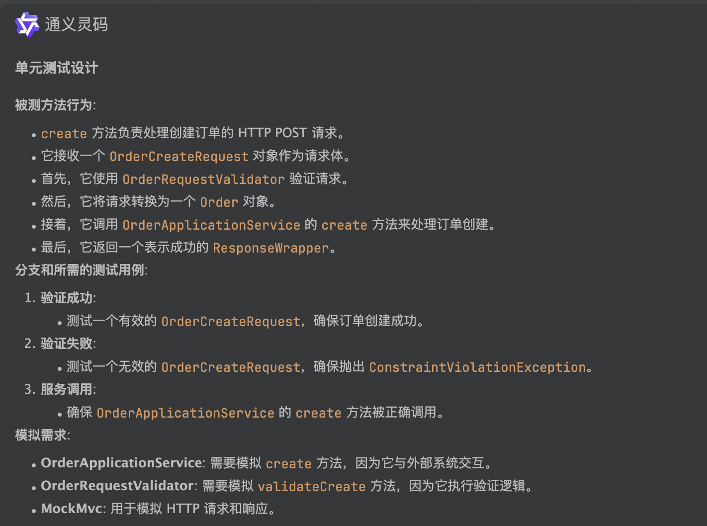
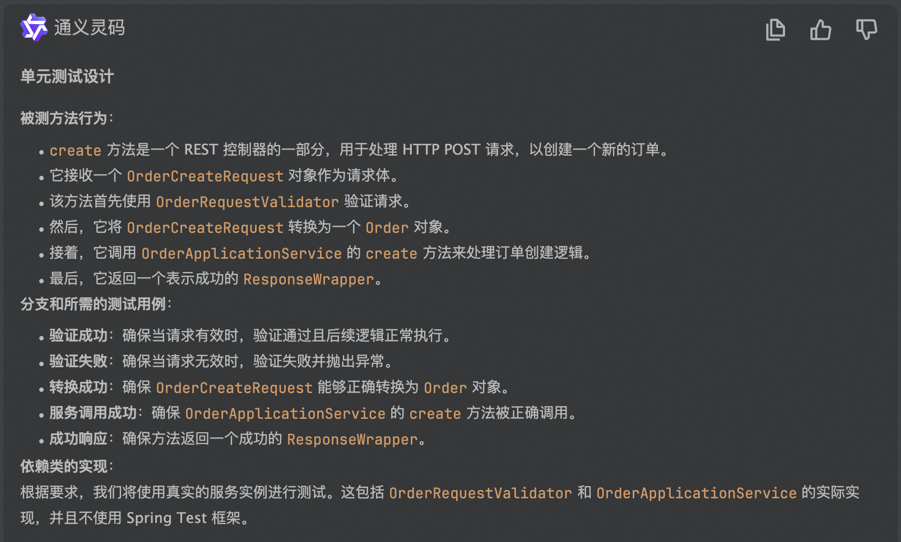

## 交互层单元测试

在Web应用中用户交互层的主要职责是接收外部各种协议的请求，并调度系统作出相应的操作和返回数据。根据不同项目的情况可以将代码进行合适的分层，在本示例代码中，将交互层代码大致分为两层，Controller层和Validator
层（随项目变化不断迭代），根据单一职责原则，需保障每一层的实现代码职责单一，同时测试代码也保持职责单一。

### 交互层职责
| **#** | **职责**       | **描述**                                                     |
| ----- | -------------- | ------------------------------------------------------------ |
| 1.    | 监听 HTTP 请求 | Controller应该响应某些 URL、HTTP 方法和内容类型。                |
| 2.    | 反序列化输入   | Controller应该解析传入的 HTTP 请求并根据 URL、HTTP 请求参数和请求正文中的变量创建 Java 对象，以便我们可以在代码中使用它们。 |
| 3.    | 验证输入       | Controller是防止错误输入的第一道防线，因此它是我们可以验证输入的地方。 |
| 4.    | 调用业务逻辑   | 解析输入后，Controller必须将输入转换为业务逻辑期望的模型并将其传递给业务逻辑。 |
| 5.    | 序列化输出     | Controller获取业务逻辑的输出并将其序列化为 HTTP 响应。           |
| 6.    | 转换异常       | 如果在某个地方发生异常，Controller应将其转换为对用户有意义的错误消息和 HTTP 状态。 |


### 测试关注点
#### Controller
Controller层的代码主要用来处理用户请求和返回处理结果，测试过程中需要考虑
* Http请求的URL、Header、Content等
* 外部Input的校验逻辑
* 内部Service、Validator、Adapter等核心逻辑的调度
* 请求和返回的格式是否正确，如Rest请求的path、requestBody、response等
> 必要的时候可以使用MockMvc、RestAssured等框架进行端到端的单元测试

#### Request
Request作为接收用户请求模型，核心关注点主要包括：
* 反序列化的正确性，如Rest请求中从json到对象的转化
* 使用SpringValidator做校验时，对校验规则的测试
* Request到系统其他类型模型的转换（也可抽象到Factory、Convert等模式）

#### Validator
对用户请求对象的校验
* 校验过程中产生的异常
* 校验可能会有很多的分支逻辑，根据业务性质选择测试用例粒度

### 使用的工具
* SpringBootTest 集成了大部分单测框架如JUnit，hamcrest，assertj，mockito

### 参考文档
* https://spring.io/guides/gs/testing-web/

### 以下为使用springMvc实现交互层代码示例

``` java
package com.example.demo.interactive.controller;

import javax.validation.Valid;
import javax.validation.constraints.NotNull;

import com.example.demo.domain.entity.Order;
import com.example.demo.interactive.request.OrderCreateRequest;
import com.example.demo.interactive.response.ResponseWrapper;
import com.example.demo.interactive.validator.OrderRequestValidator;
import com.example.demo.service.OrderApplicationService;
import org.springframework.beans.factory.annotation.Autowired;
import org.springframework.web.bind.annotation.PostMapping;
import org.springframework.web.bind.annotation.RequestBody;
import org.springframework.web.bind.annotation.RestController;

@RestController
public class OrderController {

    private final OrderApplicationService orderApplicationService;
    private final OrderRequestValidator orderRequestValidator;

    @Autowired
    public OrderController(OrderApplicationService orderApplicationService, OrderRequestValidator orderRequestValidator) {

        this.orderApplicationService = orderApplicationService;
        this.orderRequestValidator = orderRequestValidator;
    }

    @PostMapping("/orders")
    public ResponseWrapper create(@RequestBody @Valid @NotNull OrderCreateRequest orderCreateRequest) {
        orderRequestValidator.validateCreate(orderCreateRequest);
        Order order = orderCreateRequest.convert();
        orderApplicationService.create(order);
        return ResponseWrapper.success();
    }
}

```

### 使用通义灵码生成的单元测试



```java
package com.example.demo.interactive.controller;

import com.example.demo.domain.entity.Order;
import com.example.demo.interactive.request.OrderCreateRequest;
import com.example.demo.interactive.validator.OrderRequestValidator;
import com.example.demo.service.OrderApplicationService;
import org.junit.Before;
import org.junit.Test;
import org.junit.runner.RunWith;
import org.mockito.InjectMocks;
import org.mockito.Mock;
import org.mockito.junit.MockitoJUnitRunner;
import org.springframework.http.MediaType;
import org.springframework.test.web.servlet.MockMvc;
import org.springframework.test.web.servlet.setup.MockMvcBuilders;

import static org.mockito.ArgumentMatchers.any;
import static org.mockito.Mockito.doNothing;
import static org.mockito.Mockito.when;
import static org.springframework.test.web.servlet.request.MockMvcRequestBuilders.post;
import static org.springframework.test.web.servlet.result.MockMvcResultMatchers.status;

@RunWith(MockitoJUnitRunner.class)
public class OrderControllerApiTest {

    private MockMvc mockMvc;

    @Mock
    private OrderApplicationService orderApplicationService;

    @Mock
    private OrderRequestValidator orderRequestValidator;

    @InjectMocks
    private OrderController orderController;

    @Before
    public void setup() {
        mockMvc = MockMvcBuilders.standaloneSetup(orderController).build();
    }

    @Test
    public void create_ValidRequest_ReturnsSuccess() throws Exception {
        OrderCreateRequest orderCreateRequest = new OrderCreateRequest();
        Order order = new Order();
        when(orderCreateRequest.convert()).thenReturn(order);
        doNothing().when(orderApplicationService).create(any(Order.class));

        mockMvc.perform(post("/orders")
                .contentType(MediaType.APPLICATION_JSON)
                .content("{\"address\":\"123 Main St\",\"memberId\":1,\"productCount\":1,\"productId\":1,\"supplierId\":1}"))
            .andExpect(status().isOk());
    }

    @Test
    public void create_InvalidRequest_ThrowsException() throws Exception {
        // 假设 validateCreate 方法抛出 BadRequestException
        doNothing().when(orderRequestValidator).validateCreate(any(OrderCreateRequest.class));

        mockMvc.perform(post("/orders")
                .contentType(MediaType.APPLICATION_JSON)
                .content("{\"address\":\"\",\"memberId\":null,\"productCount\":1,\"productId\":1,\"supplierId\":1}"))
            .andExpect(status().isBadRequest());
    }
}
```

### 单元测试生成结果分析
1. 正确性：
   1. 执行失败，对测试框架的使用有一定偏差，可能是测试框架版本和训练所用代码版本不一致导致，微调后可正确执行
   2. 第二个用例错误，代码与测试用例语义不符
   3. 测试方法名与代码仓库风格不一致
2. 有效性：生成的单元测试代码已经正确实现了对OrderController类的create方法的测试，并使用了MockMvc进行对HTTP请求的模拟测试
3. 丰富性：测试用例的丰富度足够，对正确输入、异常输入、边界输入都做了覆盖
4. 测试设计按照以下几个点分别展开Prompt，整体比较合理
   1. 被测方法行为
   2. 分支和所需的测试用例
   3. 依赖类的实现
5. 通过对话引导，不使用MockMvc和Mockito进行测试，生成测试结果如下：
   1. 当测试覆盖多个相关类时，单元测试会出现混乱，测试用例的语义与实际测试代码不符
   2. 测试目标方法发生了变化，如第三个测试用例
   3. 整体来看，当依赖类使用真实实现时，测试代码会比较混乱



```java

package com.example.demo.interactive.controller;

import com.example.demo.domain.entity.Order;
import com.example.demo.exception.BadRequestException;
import com.example.demo.interactive.request.OrderCreateRequest;
import com.example.demo.interactive.response.ResponseWrapper;
import com.example.demo.interactive.validator.OrderRequestValidator;
import com.example.demo.service.OrderApplicationService;
import org.junit.Before;
import org.junit.Test;

import java.math.BigDecimal;

import static org.junit.Assert.*;

public class OrderControllerTest {

    private OrderController orderController;
    private OrderApplicationService orderApplicationService;
    private OrderRequestValidator orderRequestValidator;

    @Before
    public void setUp() {
        // 实例化真实的依赖对象
        orderApplicationService = new OrderApplicationService(null, null, null);
        orderRequestValidator = new OrderRequestValidator();

        // 实例化控制器
        orderController = new OrderController(orderApplicationService, orderRequestValidator);
    }

    @Test
    public void testCreate_ValidRequest_ShouldReturnSuccess() {
        // 准备有效的 OrderCreateRequest
        OrderCreateRequest request = new OrderCreateRequest();
        request.setAddress("123 Main St");
        request.setMemberId(1L);
        request.setProductCount(10L);
        request.setProductId(100L);
        request.setSupplierId(200L);
        request.setOrderAmountTotal(new BigDecimal("100.00"));
        request.setProductAmountTotal(new BigDecimal("90.00"));

        // 执行测试
        ResponseWrapper response = orderController.create(request);

        // 断言结果
        assertNotNull(response);
        assertTrue(response.isSuccess());
        assertNull(response.getMessage()); // 因为是成功的响应，message 应该为空
    }

    @Test(expected = BadRequestException.class)
    public void testCreate_InvalidRequest_ShouldThrowBadRequestException() {
        // 准备无效的 OrderCreateRequest
        OrderCreateRequest request = new OrderCreateRequest();
        request.setAddress(""); // 无效地址
        request.setMemberId(null); // 无效 memberId

        // 执行测试（预期抛出 BadRequestException）
        orderController.create(request);
    }

    @Test
    public void testCreate_ConvertToOrder_ShouldWorkCorrectly() {
        // 准备有效的 OrderCreateRequest
        OrderCreateRequest request = new OrderCreateRequest();
        request.setAddress("123 Main St");
        request.setMemberId(1L);
        request.setProductCount(10L);
        request.setProductId(100L);
        request.setSupplierId(200L);
        request.setOrderAmountTotal(new BigDecimal("100.00"));
        request.setProductAmountTotal(new BigDecimal("90.00"));

        // 执行测试
        Order order = request.convert();

        // 断言结果
        assertNotNull(order);
        assertEquals("123 Main St", order.getAddress());
        assertEquals(new BigDecimal("100.00"), order.getOrderAmountTotal());
        assertEquals(new BigDecimal("90.00"), order.getProductAmountTotal());
        assertEquals(10L, order.getProductCount().longValue());
        assertEquals(100L, order.getProductId().longValue());
        assertEquals(200L, order.getSupplierId().longValue());
    }
}
```
