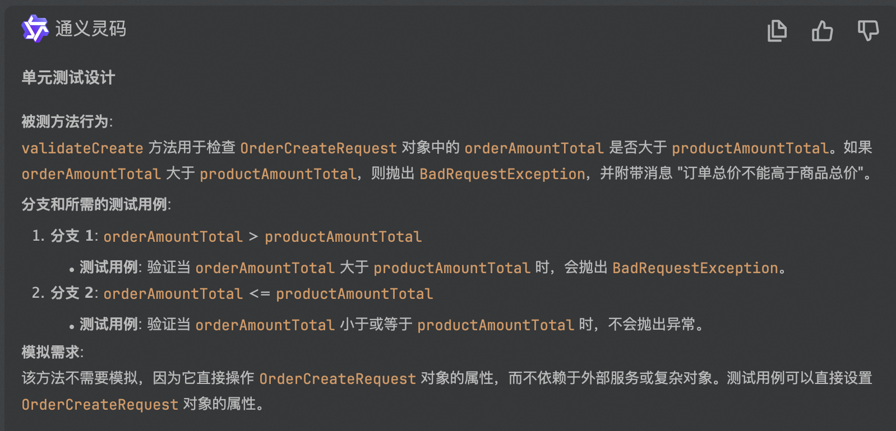

### 代码示例

```java
package com.example.demo.interactive.validator;

import com.example.demo.exception.BadRequestException;
import com.example.demo.interactive.request.OrderCreateRequest;
import org.springframework.stereotype.Component;

@Component
public class OrderRequestValidator {

    public void validateCreate(OrderCreateRequest orderCreateRequest) {
        if (orderCreateRequest.getOrderAmountTotal().compareTo(orderCreateRequest.getProductAmountTotal()) > 0) {
            throw new BadRequestException("订单总价不能高于商品总价");
        }
    }
}

```

### 生成测试代码
```java
package com.example.demo.interactive.validator;


import com.example.demo.exception.BadRequestException;
import com.example.demo.interactive.request.OrderCreateRequest;
import org.junit.Before;
import org.junit.Test;
import org.junit.runner.RunWith;
import org.mockito.InjectMocks;
import org.mockito.junit.MockitoJUnitRunner;

import java.math.BigDecimal;

import static org.junit.Assert.assertThrows;

@RunWith(MockitoJUnitRunner.class)
public class OrderRequestValidatorTest {

    @InjectMocks
    private OrderRequestValidator orderRequestValidator;

    private OrderCreateRequest orderCreateRequest;

    @Before
    public void setUp() {
        orderCreateRequest = new OrderCreateRequest();
    }

    @Test
    public void validateCreate_OrderAmountTotalGreaterThanProductAmountTotal_ShouldThrowBadRequestException() {
        orderCreateRequest.setOrderAmountTotal(new BigDecimal("100.00"));
        orderCreateRequest.setProductAmountTotal(new BigDecimal("50.00"));

        assertThrows(BadRequestException.class, () -> orderRequestValidator.validateCreate(orderCreateRequest));
    }

    @Test
    public void validateCreate_OrderAmountTotalEqualToProductAmountTotal_ShouldNotThrowException() {
        orderCreateRequest.setOrderAmountTotal(new BigDecimal("100.00"));
        orderCreateRequest.setProductAmountTotal(new BigDecimal("100.00"));

        orderRequestValidator.validateCreate(orderCreateRequest); // 不应该抛出异常
    }

    @Test
    public void validateCreate_OrderAmountTotalLessThanProductAmountTotal_ShouldNotThrowException() {
        orderCreateRequest.setOrderAmountTotal(new BigDecimal("50.00"));
        orderCreateRequest.setProductAmountTotal(new BigDecimal("100.00"));

        orderRequestValidator.validateCreate(orderCreateRequest); // 不应该抛出异常
    }
}

```

### 结果分析

1. 整体符合预期（详见[README.md](..%2FREADME.md)）
2. 有问题的点同Case1（[简单方法的单元测试.md](..%2FCase2%2F%E7%AE%80%E5%8D%95%E6%96%B9%E6%B3%95%E7%9A%84%E5%8D%95%E5%85%83%E6%B5%8B%E8%AF%95.md)）
3. 被测类虽然有Spring @Component注解，但被测方法实际并未注入任何依赖，测试代码引用MockitoRunner有点多余
