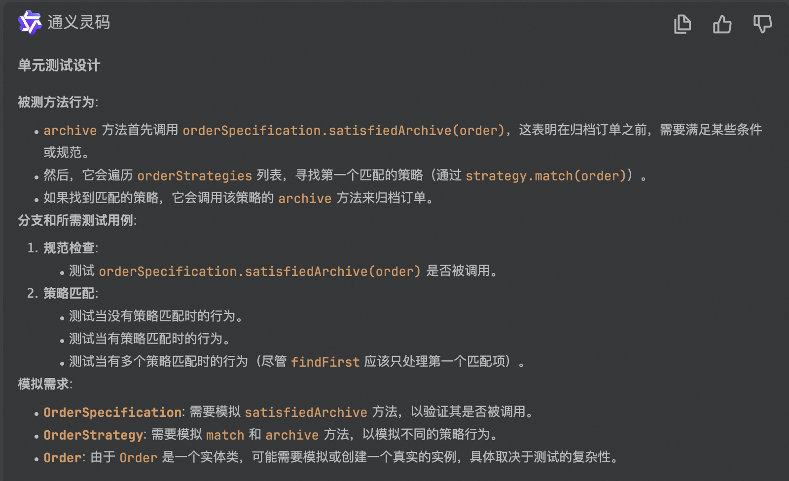

### 代码示例

```java
package com.example.demo.domain.service;

import java.util.List;

import com.example.demo.domain.entity.Order;
import com.example.demo.domain.service.specfication.OrderSpecification;
import com.example.demo.domain.service.strategy.OrderStrategy;
import org.springframework.beans.factory.annotation.Autowired;
import org.springframework.stereotype.Service;

@Service
public class OrderService {

    private final List<OrderStrategy> orderStrategies;
    private final OrderSpecification orderSpecification;

    @Autowired
    public OrderService(List<OrderStrategy> orderStrategies, OrderSpecification orderSpecification) {
        this.orderStrategies = orderStrategies;
        this.orderSpecification = orderSpecification;
    }

    public void archive(Order order) {
        orderSpecification.satisfiedArchive(order);
        orderStrategies.stream()
            .filter(strategy -> strategy.match(order))
            .findFirst()
            .ifPresent(strategy -> strategy.archive(order));
    }

}

```

### 生成测试代码


```java
package com.example.demo.domain.service;


import com.example.demo.domain.entity.Order;
import com.example.demo.domain.service.specfication.OrderSpecification;
import com.example.demo.domain.service.strategy.OrderStrategy;
import org.junit.Before;
import org.junit.Test;
import org.junit.runner.RunWith;
import org.mockito.InjectMocks;
import org.mockito.Mock;
import org.mockito.Mockito;
import org.mockito.junit.MockitoJUnitRunner;

import java.util.Arrays;
import java.util.Collections;
import java.util.List;

import static org.mockito.Mockito.*;

@RunWith(MockitoJUnitRunner.class)
public class OrderServiceTest {

    @Mock
    private OrderSpecification orderSpecification;

    @Mock
    private OrderStrategy orderStrategy1;

    @Mock
    private OrderStrategy orderStrategy2;

    @InjectMocks
    private OrderService orderService;

    private Order order;

    @Before
    public void setUp() {
        order = new Order();
    }

    @Test
    public void archive_NoMatchingStrategy_SpecificationCalled() {
        when(orderStrategy1.match(order)).thenReturn(false);
        when(orderStrategy2.match(order)).thenReturn(false);

        orderService.archive(order);

        verify(orderSpecification, times(1)).satisfiedArchive(order);
        verify(orderStrategy1, times(1)).match(order);
        verify(orderStrategy2, times(1)).match(order);
        verify(orderStrategy1, never()).archive(order);
        verify(orderStrategy2, never()).archive(order);
    }

    @Test
    public void archive_OneMatchingStrategy_SpecificationAndStrategyCalled() {
        when(orderStrategy1.match(order)).thenReturn(true);
        when(orderStrategy2.match(order)).thenReturn(false);

        orderService.archive(order);

        verify(orderSpecification, times(1)).satisfiedArchive(order);
        verify(orderStrategy1, times(1)).match(order);
        verify(orderStrategy1, times(1)).archive(order);
        verify(orderStrategy2, times(1)).match(order);
        verify(orderStrategy2, never()).archive(order);
    }

    @Test
    public void archive_MultipleMatchingStrategies_FirstStrategyCalled() {
        when(orderStrategy1.match(order)).thenReturn(true);
        when(orderStrategy2.match(order)).thenReturn(true);

        orderService.archive(order);

        verify(orderSpecification, times(1)).satisfiedArchive(order);
        verify(orderStrategy1, times(1)).match(order);
        verify(orderStrategy1, times(1)).archive(order);
        verify(orderStrategy2, times(1)).match(order);
        verify(orderStrategy2, never()).archive(order);
    }
}

```

### 结果分析
1. 整体符合预期（详见[README.md](..%2FREADME.md)）
2. 有问题的点同Case1（[简单方法的单元测试.md](..%2FCase2%2F%E7%AE%80%E5%8D%95%E6%96%B9%E6%B3%95%E7%9A%84%E5%8D%95%E5%85%83%E6%B5%8B%E8%AF%95.md)）
3. 尝试追加Prompt使测试不要模拟依赖类，但没有成功
