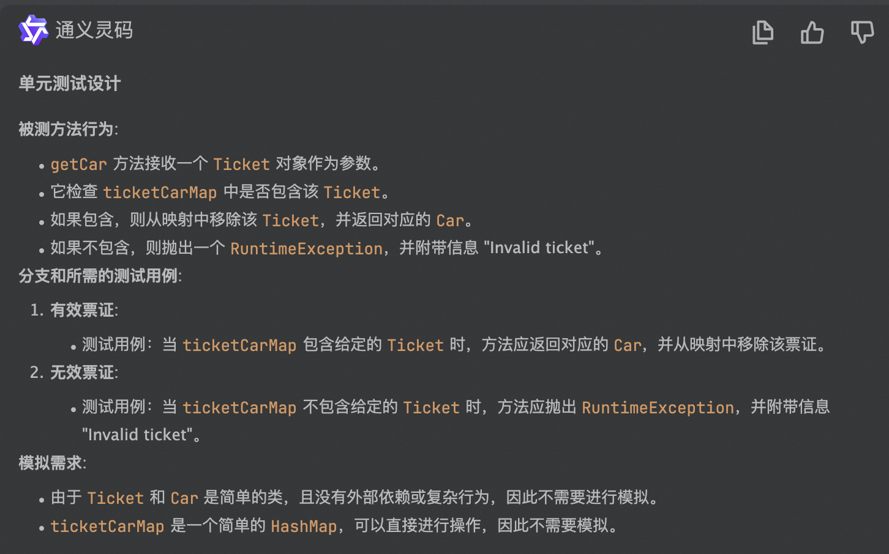

### 代码示例

```java
import java.util.HashMap;

public class ParkingLot {
    private final int capacity;
    private HashMap<Ticket, Car> ticketCarMap = new HashMap<>();

    public ParkingLot(int capacity) {
        this.capacity = capacity;
    }

    public Ticket parkCar(Car car) {
        if (ticketCarMap.size() < capacity){
            Ticket ticket = new Ticket();
            ticketCarMap.put(ticket, car);
            return ticket;
        }
        throw new RuntimeException("No available position");
    }

    public Car getCar(Ticket ticket){
        if (ticketCarMap.containsKey(ticket)) {
            Car car = ticketCarMap.get(ticket);
            ticketCarMap.remove(ticket);
            return car;
        }
        throw new RuntimeException("Invalid ticket");
    }
}


```

### 生成测试代码


```java
import org.junit.jupiter.api.BeforeEach;
import org.junit.jupiter.api.Test;

import static org.junit.jupiter.api.Assertions.assertEquals;
import static org.junit.jupiter.api.Assertions.assertFalse;
import static org.junit.jupiter.api.Assertions.assertNotNull;
import static org.junit.jupiter.api.Assertions.assertThrows;

public class ParkingLotTest {

    private ParkingLot parkingLot;
    private Ticket ticket;
    private Car car;

    @BeforeEach
    public void setUp() {
        parkingLot = new ParkingLot(10); // 设置一个容量为2的停车场
        ticket = new Ticket();
        car = new Car();
    }

    @Test
    public void parkCar_WithAvailablePosition_ReturnsTicket() {
        Car car = new Car();
        Ticket ticket = parkingLot.parkCar(car);
        assertNotNull(ticket);
        assertEquals(1, parkingLot.ticketCarMap.size());
    }

    @Test
    public void parkCar_WithNoAvailablePosition_ThrowsException() {
        Car car1 = new Car();
        Car car2 = new Car();
        Car car3 = new Car();

        parkingLot.parkCar(car1);
        parkingLot.parkCar(car2);

        RuntimeException exception = assertThrows(RuntimeException.class, () -> {
            parkingLot.parkCar(car3);
        });

        assertEquals("No available position", exception.getMessage());
    }

    @Test
    public void getCar_ValidTicket_ReturnsCarAndRemovesTicket() {
        parkingLot.ticketCarMap.put(ticket, car);
        Car retrievedCar = parkingLot.getCar(ticket);
        assertNotNull(retrievedCar);
        assertEquals(car, retrievedCar);
        assertFalse(parkingLot.ticketCarMap.containsKey(ticket));
    }

    @Test
    public void getCar_InvalidTicket_ThrowsRuntimeException() {
        RuntimeException exception = assertThrows(RuntimeException.class, () -> {
            parkingLot.getCar(ticket);
        });
        assertEquals("Invalid ticket", exception.getMessage());
    }
}
```

### 结果分析
1. 整体符合预期（详见[README.md](..%2FREADME.md)）
2. 对于这种无框架依赖的代码，测试代码对依赖类的处理简单，不会产生过度模拟的情况
3. 测试代码编译失败，主要原因是测试代码中依赖了生产代码中类的私有数据进行测试数据模拟和断言，导致编译失败
