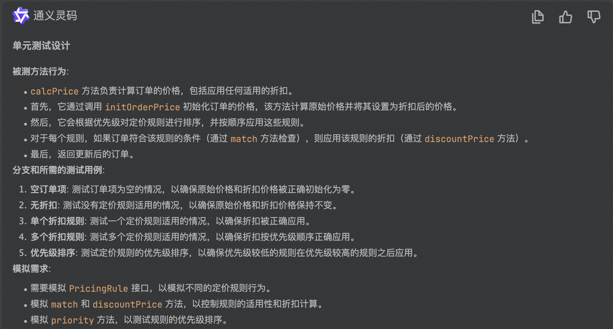

### 代码示例

```java
package com.razor.ecommerce.domain.service;

import java.math.BigDecimal;
import java.util.Comparator;
import java.util.List;

import com.razor.ecommerce.domain.model.entity.Order;
import com.razor.ecommerce.domain.model.valueobject.OrderItem;
import org.springframework.beans.factory.annotation.Autowired;
import org.springframework.stereotype.Service;
import org.springframework.util.CollectionUtils;

@Service
public class PricingService {
    private final List<PricingRule> pricingRules;

    @Autowired
    public PricingService(List<PricingRule> pricingRules) {
        this.pricingRules = pricingRules;
    }

    public Order calcPrice(Order order) {
        initOrderPrice(order);
        PricingRule[] rules = pricingRules.stream().sorted(Comparator.comparingInt(PricingRule::priority)).toArray(PricingRule[]::new);
        for (PricingRule rule : rules) {
            if (rule.match(order)) {
                order = rule.discountPrice(order);
            }
        }
        return order;
    }

    private void initOrderPrice(Order order) {
        order.setOriginalPrice(calcOriginPrice(order));
        order.setDiscountedPrice(order.getOriginalPrice());
    }

    private BigDecimal calcOriginPrice(Order order) {
        List<OrderItem> orderItems = order.getItems();
        if (CollectionUtils.isEmpty(orderItems)) {
            return BigDecimal.ZERO;
        }
        return orderItems.stream()
            .map(item -> item.getProduct().getPrice().multiply(new BigDecimal(item.getCount())))
            .reduce(BigDecimal.ZERO, BigDecimal::add);
    }
}


```

### 生成测试代码


```java
package com.razor.ecommerce.domain.service;


import com.razor.ecommerce.domain.model.entity.Order;
import com.razor.ecommerce.domain.model.valueobject.OrderItem;
import com.razor.ecommerce.domain.model.valueobject.Product;
import org.junit.Before;
import org.junit.Test;
import org.junit.runner.RunWith;
import org.mockito.InjectMocks;
import org.mockito.Mock;
import org.mockito.Mockito;
import org.mockito.junit.MockitoJUnitRunner;

import java.math.BigDecimal;
import java.util.ArrayList;
import java.util.List;

import static org.junit.Assert.assertEquals;
import static org.mockito.Mockito.when;

@RunWith(MockitoJUnitRunner.class)
public class PricingServiceTest {

    @Mock
    private PricingRule rule1;

    @Mock
    private PricingRule rule2;

    @InjectMocks
    private PricingService pricingService;

    private Order order;

    @Before
    public void setUp() {
        order = new Order();
        List<OrderItem> items = new ArrayList<>();
        items.add(new OrderItem(new Product("Product1", BigDecimal.valueOf(100)), 2L));
        order.setItems(items);
    }

    @Test
    public void calcPrice_NoRules_NoDiscount() {
        when(rule1.match(order)).thenReturn(false);
        when(rule2.match(order)).thenReturn(false);

        Order result = pricingService.calcPrice(order);

        assertEquals(BigDecimal.valueOf(200), result.getOriginalPrice());
        assertEquals(BigDecimal.valueOf(200), result.getDiscountedPrice());
    }

    @Test
    public void calcPrice_SingleRule_DiscountApplied() {
        when(rule1.match(order)).thenReturn(true);
        when(rule1.discountPrice(order)).thenReturn(order);
        when(rule1.priority()).thenReturn(1);

        Order result = pricingService.calcPrice(order);

        assertEquals(BigDecimal.valueOf(200), result.getOriginalPrice());
        assertEquals(BigDecimal.valueOf(150), result.getDiscountedPrice());
    }

    @Test
    public void calcPrice_MultipleRules_DiscountsApplied() {
        when(rule1.match(order)).thenReturn(true);
        when(rule1.discountPrice(order)).thenReturn(order);
        when(rule1.priority()).thenReturn(1);

        when(rule2.match(order)).thenReturn(true);
        when(rule2.discountPrice(order)).thenReturn(order);
        when(rule2.priority()).thenReturn(2);

        Order result = pricingService.calcPrice(order);

        assertEquals(BigDecimal.valueOf(200), result.getOriginalPrice());
        assertEquals(BigDecimal.valueOf(100), result.getDiscountedPrice());
    }

    @Test
    public void calcPrice_EmptyOrderItems_ZeroPrice() {
        order.setItems(new ArrayList<>());

        Order result = pricingService.calcPrice(order);

        assertEquals(BigDecimal.ZERO, result.getOriginalPrice());
        assertEquals(BigDecimal.ZERO, result.getDiscountedPrice());
    }

    @Test
    public void calcPrice_PriorityOrdering_RulesAppliedInOrder() {
        when(rule1.match(order)).thenReturn(true);
        when(rule1.discountPrice(order)).thenReturn(order);
        when(rule1.priority()).thenReturn(2);

        when(rule2.match(order)).thenReturn(true);
        when(rule2.discountPrice(order)).thenReturn(order);
        when(rule2.priority()).thenReturn(1);

        Order result = pricingService.calcPrice(order);

        assertEquals(BigDecimal.valueOf(200), result.getOriginalPrice());
        assertEquals(BigDecimal.valueOf(100), result.getDiscountedPrice());
    }
}

```

### 结果分析
1. 对生产代码的理解和分析基本正确，测试代码的设计基本正确
2. 测试代码编译失败，修改后编译通过，测试用例执行失败
3. 还是存在对依赖过度模拟的问题
4. 分支逻辑的覆盖表现很好
